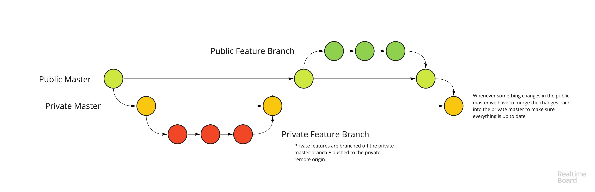

# Monorepo concept

This is a test repo for a proof of concept for partially public mono repos.

## Basic setup

[https://24ways.org/2013/keeping-parts-of-your-codebase-private-on-github/](https://24ways.org/2013/keeping-parts-of-your-codebase-private-on-github/)

## Git flow

