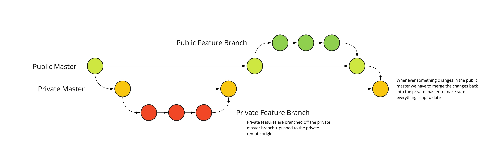

# Monorepo Concept

This is a test repo for a proof of concept for partially public mono repos.

## Basic setup

The general setup follows [an example by Harry Roberts](https://24ways.org/2013/keeping-parts-of-your-codebase-private-on-github/) of how to keep parts of your codebase private on github. Essentially its about setting up 2 repositories and have all public branches commit to the public remote, and all private branches commit to the private remote.

In commands this would means something like the following:

```bash
# Cloning the public repo will automatically set up the public remote as "origin"
git clone git@github.com:julianburr/monorepo-concept.git
cd monorepo-concept

# We then want to manually add the private remote, i.e. with the alias "private"
# This way we can easily reference it in push commands via "-u private"!
git remote add private git@github.com:julianburr/monorepo-concept-private.git
```

This means public contributors don't even need to have any knowledge about the private remote, they can simply clone the public repo and push their contributions into the public remote, we then need to make sure they are merged back into the private remote by us to make sure everything stays in sync (see git flow below).

## Git flow

Basically we want to make sure that all private contributions are pushed to the private remote, while all public contributions are pushed to the public remote AND the merged back into the private remote. We never want the private remote to fall behind the public remote.



This resembles more or less the following command flow:

```bash
# Clone public remote
git clone git@github.com:julianburr/monorepo-concept.git
cd monorepo-concept

# Add private remote
git remote add private git@github.com:julianburr/monorepo-concept-private.git

# Checkout private master
git checkout master-private private

# Create private feature branch
git checkout -b feature/private
git commit -m 'Some private commit'
# ...and push to private remote
git push -u private feature/private

# Merge into private master + push (again to private remote)
git checkout master-private
git merge --no-ff feature/private
git push -u private master-private

# Create a public feature branch
git checkout master
git checkout -b feature/public
git commit -m 'Some public commit'
# ...and commit to public remote
git push -u origin feaure/public

# Merge into public master
git checkout master
git merge --no-ff feature/public
git push -u origin master

# Merge public master back into private master
# This is important, we never want the private master to fall behind the public one!
git checkout master-private
git merge master
git push -u private master-private

# Thats it! 🎉
```

## Possible helper tool

Ideally all the git stuff can be abstracted out into a helper client, e.g. (in pseudo code)

```bash
# Lets call the helper client "mono-cli"

# Clone / Setup
mono-cli clone [target]

# Will run:
#  git clone git@github.com:julianburr/monorepo-concept.git [target]
#  cd [target]
#  git remote add private git@github.com:julianburr/monorepo-concept-private.git

# ...
```

This helper client is obviously meant for internal use to make dealing with the private remote easier. As mentioned before, there is no need to abstract anything for public contributors, since for them the repo will appear as a normal public mono repo!

## Possible git hooks

### Pre commit

Pre commit hooks are pretty common and useful to handle stuff like eslint and prettier. You can also check the commit message here when using commitizen (+ making sure the commit has a proper scope linking it to a specific package in the mono repo).

* [https://gist.github.com/primaryobjects/9ab8d2346aa58ef6959ad357bb835963](https://gist.github.com/primaryobjects/9ab8d2346aa58ef6959ad357bb835963)
* [https://github.com/okonet/lint-staged](https://github.com/okonet/lint-staged)

### Pre push

This might get really handy when it comes to handling private and public remotes. To avoid accidental pushes of private code to the public remote a pre-push hook could check what the base branch of the current branch is and accordingly throw an error if you try to push a private feature branch to the public remote.

### Github bot for private remote?

**TODO: research**

Not sure if that is possible, but it would be really nice to have a github bot set up in the private repo that listens to pushes to the public master and automatically merges the changes back into the private master. This way we can't accidentially fall behind the private repo.

## Yarn workspaces + lerna

These are basics on general handling of mono repos. A lot of good resources and reads can be found in [this awesome list](https://github.com/korfuri/awesome-monorepo).

### Yarn workspaces

We're using yarn workspaces to make sure all packages within the mono-repo are symlinked between each other, which makes local development much easier and also hoists dependencies up to the root.

The following is an example root `package.json` to enable workspaces:

```json
{
  "private": true,
  "name": "monorepo-concept",
  "workspaces": [
    "components/*",
    "modules/*"
  ]
}
```

The root must be private, it's a yarn security measure to avoid acidentially publishing workspace roots. In the example we define everything in the `components` and `modules` subfolders as workspaces. Workspaces are the individual repos for the different packages living in the mono repo. They all have their own `package.json` etc, yarn just manages those dependencies through the workspace root whenever possible + symlinks all packages that exist within the mono repo.

Some good reads:

* [https://yarnpkg.com/lang/en/docs/workspaces/](https://yarnpkg.com/lang/en/docs/workspaces/)
* https://yarnpkg.com/blog/2017/08/02/introducing-workspaces/

### Lerna

Lerna is a tool to help manage packages within a mono repo, basically doing everything that goes beyond dependency management, which is done by yarn itself.

In a nutshell: lerna makes it easy to execute operations across multiple packages within your mono repo. This is especially interesting for publishing packages, where lerna can help keeping versions in sync, running tests across all packages (which could be helpful e.g. for CI), etc.

An example config in `lerna.json` looks as simple as this:

```json
{
  "packages": [
    "components/*",
    "modules/*"
  ],
  "version": "independent"
}
```

Example commands could look something like the following:

```json
{
  "scripts": {
    "bootstrap": "lerna run bootstrap",
    "test": "lerna run test",
    "publish:check": "lerna changed",
    "publish": "lerna publish"
  }
}
```

Resources and good reads:

- [https://github.com/lerna/lerna](https://github.com/lerna/lerna)
- [https://lernajs.io/](https://lernajs.io/)

#### Publishing packages

As mentioned above, one of lernas responsibilities would be version management. Lerna can help keeping versions in sync (e.g. if you bump package A, it also bumps and publishes all packages that have A as dependency).

Some examples for version handling via lerna commands below:

```bash
# Publish all changed packages using conventional commits for version bump
lerna publish --conventional-commits 

# Publish a specific kind of version bump
# e.g. pre-release with rc prefix (i.e. v 1.0.0-rc.0)
lerna publish --conventional-commits --cd-version prerelease --preid rc --npm-tag rc

# Publish only a specific package (+ packages that depend on it)
lerna publish --conventional-commits --scope [package name]

# Publish all changed except for specific package
lerna publish --conventional-commits --ignore [package name]
```

#### Semver + conventional commits

As mentioned above lerna will take care of this for us when using it like so:

```bash
lerna publish --conventional-commits
```

It will look at all commits since the last release and determine from the commit messages what the next semver version should be. It will also create a `CHANGELOG.md` entry for us with all the commits grouped by type (again, using the commit messages for that).

To make sure everyone sticks to the commit message standard, we can add a pre-commit hook that checks for it:

```json
{
  "husky": {
    "hooks": {
      "commit-msg": "commitlint -E HUSKY_GIT_PARAMS"
    }  
  }
}
```

This will throw if the commit message is invalid.

Good reads:

* [https://www.conventionalcommits.org/en/v1.0.0-beta.2/](https://www.conventionalcommits.org/en/v1.0.0-beta.2/)
* [https://semver.org/](https://semver.org/)
* [https://github.com/conventional-changelog/conventional-changelog](https://github.com/conventional-changelog/conventional-changelog)
* [https://github.com/marionebl/commitlint](https://github.com/marionebl/commitlint)
* [https://github.com/typicode/husky](https://github.com/typicode/husky)

